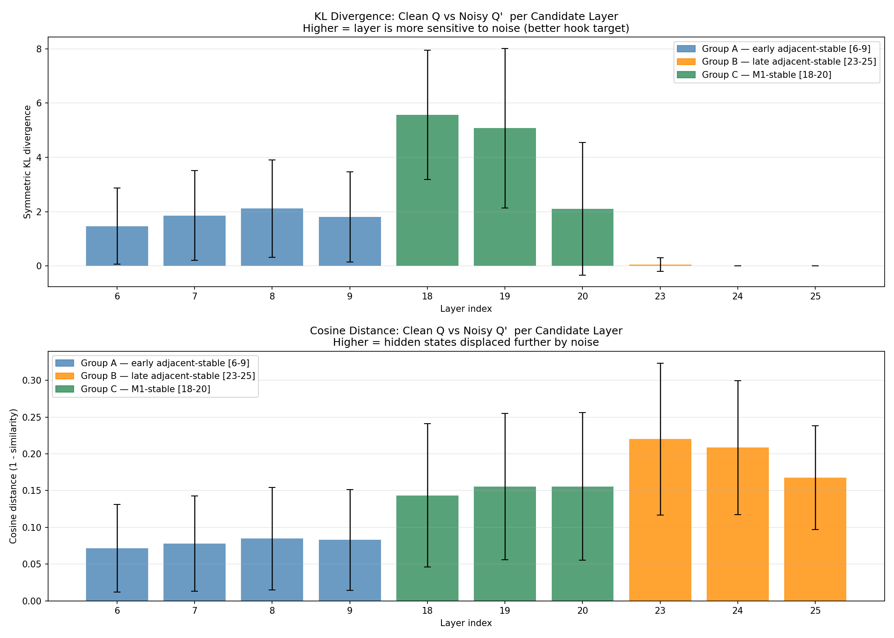

# LARA
Latent Alignment for Reasoning Agents 

a method for improving robust reasoning in LLMs under noisy inputs by aligning internal representations rather than just outputs.

This approach identifies stable intermediate layers and enforces latent alignment between clean and noisy inputs using a dual-model training setup. By combining supervised fine-tuning with representation alignment and regularization, the model learns to maintain consistent reasoning trajectories despite perturbations.

This leads to significant improvements in robustness, achieving +15% absolute accuracy gains over standard SFT on noisy inputs.


## Beyond Pure Textual Alignment

While chain-of-thought alignment on noisy samples trains the model to produce clean traces, it does not constrain how the model internally processes noise. We extend our SFT experiments with **activation-level alignment** by directly constraining hidden states at stable layers.

---

### Identifying Candidate Stable Layers

We define **stable layers** as those that have formed semantically meaningful representations.

We introduce two complementary stability metrics:

- **Global Alignment (M1)**  
  Measures alignment with the final representation:

  $$
  \mathrm{KL}(h_L \,\|\, h_{\text{last}})
  $$

- **Local Stability (M2)**  
  Measures stability across adjacent layers:

  $$
  \mathrm{KL}(h_L \,\|\, h_{L+1})
  $$

Low values indicate convergence and stability respectively.

We select candidate layers using percentile thresholds on both metrics and take their **intersection**.



---

#### Observations

- **Early layers (6–9):** Locally stable but not aligned to final output  
- **Middle layers (18–20):** Semantically meaningful but still evolving  
- **Late layers (23–25):** Stable decoding/output refinement  

Since no overlap exists, we select **layer bands**:

- Early: `6–9`
- Middle: `18–20`
- Late: `23–25`


---

### Narrowing the Effects of Noise

We evaluate how noise affects representations using paired inputs:

- Clean input: $Q$
- Noisy input: $Q'$

We compute:

1. **Distributional Shift (KL Divergence):**
   $$
   \mathrm{KL}(h_L(Q) \,\|\, h_L(Q'))
   $$

2. **Geometric Shift (Cosine Distance):**
   $$
   1 - \cos(h_L(Q), h_L(Q'))
   $$

---

#### Key Findings

- **Early layers:** Low divergence → robust to noise  
- **Middle layers:** Highest divergence → most noise-sensitive  
- **Late layers:** Low KL but high cosine shift → directional changes  

**Final hook layer ranking:** : 18, 19 > 8 > 20 > 7


---

### Aligning Reasoning Traces

We adopt a **dual-model training setup**:

- **Frozen model:** processes clean input $Q$
- **Trainable model:** processes noisy input $Q'$

Projection heads are attached at layers: {8, 18, 19}


We use the **last-token representation** as a summary of the sequence.

---

## Training Objective

### Total Loss

$$
\mathcal{L}_{\text{total}} =
\mathcal{L}_{\text{SFT}} +
\mathcal{L}_{\text{align}} +
\mathcal{L}_{\text{reg}}
$$

---

### 1. Supervised Loss

$$
\mathcal{L}_{\text{SFT}} =
\mathrm{CE}\big(f_{\theta}(Q'), A_{\text{original}}\big)
$$

The model learns to generate the **original reasoning trace** from noisy input.

---

### 2. Latent Alignment Loss

$$
\mathcal{L}_{\text{align}} =
\sum_{L \in \mathcal{S}} \lambda_L
\left(1 - \cos\big(z_L(Q), z_L(Q')\big)\right)
$$

Where:

- $z_L(\cdot) = W_L(h_L(\cdot))$
- $\mathcal{S} = \{8, 18, 19\}$

---

### 3. Regularization (VICReg)

$$
\mathcal{L}_{\text{reg}} =
\sum_{L \in \mathcal{S}} \left[
\mu \cdot \mathcal{L}_{\text{var}}(z_L) +
\nu \cdot \mathcal{L}_{\text{cov}}(z_L)
\right]
$$

This prevents:

- Representation collapse  
- Redundant features  

---

## Results

The proposed approach significantly improves robustness:

- **Standard SFT:** 31.3% accuracy  
- **Ours:** 48.4% accuracy  

 **+15% absolute improvement on noisy inputs**

---

## Visualizations

```md

